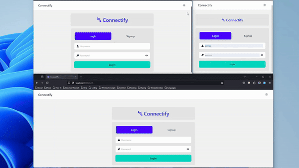
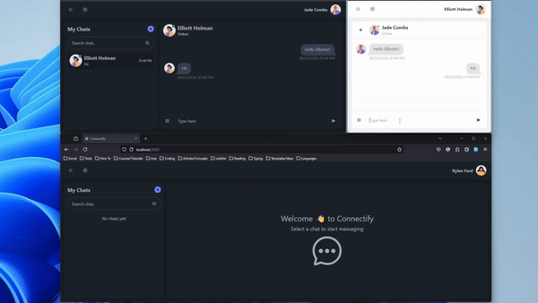
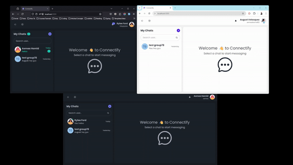

# Connectify

Connectify is a real-time Chat App that allows users to connect with friends, family, and colleagues. It features a user-friendly interface and a variety of functionalities to enhance the user experience.

## Table of Contents

- [Author](#author)
- [Demo](#demo)
- [Requirements](#requirements)
- [Features](#features)
- [Installation](#installation)
- [Usage](#usage)

## Author

[Asmaa Hamid](https://linktr.ee/asmaahamid02)

## Demo

> [Live Demo](https://connectify-gd98.onrender.com)





## Requirements

- Nodejs v18.x : [Installation guide](https://nodejs.org/en/download/package-manager/current)
- MongoDB : [Installation guide](https://www.mongodb.com/docs/atlas/getting-started/)

## Features

- Registration and authentication
- One-to-one messaging
- Group messaging
- Real-time messaging
- Real-time notifications
- Real-time online/offline status
- Typing Indicators
- Search users & rooms
- Mobile-Friendly Design
- Dark Mode

## Installation

1. Clone the repository:

   ```bash
   git clone https://github.com/asmaahamid02/connectify.git
   ```

2. Build the app:

   ```bash
   npm run build
   ```

3. Copy the `.env.example` file and rename it to `.env`:

   ```bash
   cp .env.example .env
   ```

4. Generate JWT Secret key:

   ```bash
    openssl rand -base64 32
   ```

5. Update the `.env` file with your MongoDB URI and JWT secret key

6. Start the server:

   ```bash
   npm run start
   ```

## Usage

1. Open your browser and go to `http://localhost:5000`
2. Sign up or log in to your account
3. Explore the different features and functionalities of Connectify
